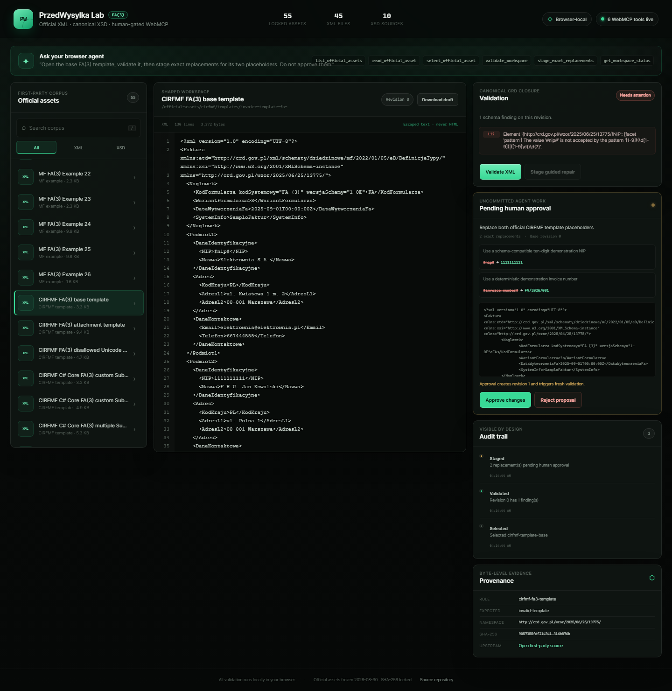

# PrzedWysylka WebMCP Lab

**A browser-local FA(3) XML workbench where a human and a browser agent inspect official data, run canonical XSD validation, and review exact repairs together.**



**Evidence scope:** the committed screenshot and automated E2E run real Chromium with a standards-shaped injected WebMCP harness. They prove the app's registration, callback, shared-state, validation, and human-gate behavior; they do not claim to test a browser vendor's native agent implementation.

## Why this exists

Structured tax XML is an unusually good WebMCP problem. A visual browser agent can click through an editor, but it should not have to guess which schema is authoritative, scrape line numbers, or silently rewrite a compliance document. The page already owns that context.

PrzedWysylka WebMCP Lab exposes six narrow browser-native tools through `document.modelContext.registerTool()`. The agent can discover the complete first-party corpus, inspect bounded source ranges, run the same local validator as the human, and stage exact replacements. **There is no agent-callable approval tool.** The human sees a diff and explicitly approves or rejects it in the UI.

## The collaboration loop

1. Select any official XML or XSD asset.
2. Validate an FA(3) XML against the canonical four-file CRD closure.
3. Ask the browser agent to inspect the finding and stage exact replacements.
4. Review the pending diff. The approved draft is still unchanged.
5. Approve or reject in the human UI.
6. Approval creates a new revision and triggers fresh browser-local validation.
7. Inspect the audit trail and byte-level provenance.

Try this prompt in ChatGPT Desktop's browser or WebMCP-enabled Chrome:

> Open the base FA(3) template, validate it, then stage exact replacements for its two placeholders. Do not approve them.

## WebMCP tool surface

| Tool                       | Effect                                                               | Guardrail                                                |
| -------------------------- | -------------------------------------------------------------------- | -------------------------------------------------------- |
| `list_official_assets`     | Returns filtered corpus metadata                                     | Read-only                                                |
| `read_official_asset`      | Returns at most 120 source lines                                     | Read-only, untrusted-content annotation                  |
| `select_official_asset`    | Synchronizes the shared UI selection                                 | Loads only a locked official asset                       |
| `validate_workspace`       | Runs canonical FA(3) validation and mirrors findings into the UI     | Cannot validate XSD or the adjacent UBL fixture as FA(3) |
| `stage_exact_replacements` | Creates an atomic pending proposal                                   | Exact, unique, non-overlapping matches; never applies    |
| `get_workspace_status`     | Returns revision, hashes, validation, proposal, and history metadata | Read-only                                                |

Tool inputs are validated with Zod because native WebMCP input-schema validation remains experimental. All descriptions are static developer-authored strings. XML returned to an agent is explicitly annotated as untrusted content.

## Complete official corpus

The repository does not cherry-pick convenient examples.

| Source class                           | Count | Runtime role                                                |
| -------------------------------------- | ----: | ----------------------------------------------------------- |
| Ministry of Finance FA(3) example XMLs |    26 | All validate against canonical CRD XSD                      |
| CIRFMF FA(3) XML templates             |     3 | Expected-invalid raw templates used for review/repair       |
| CIRFMF PEF/UBL XML fixture             |     1 | Adjacent source fixture, explicitly not classified as FA(3) |
| Canonical CRD XSD closure              |     4 | Active validation root plus all transitive dependencies     |
| CIRFMF XSD source records              |     2 | Provenance/comparison only                                  |

That is **36 locked source records: 30 XML and 6 XSD**. Every record includes its source URL/path, upstream revision where applicable, byte length, SHA-256, namespace, role, and expected validation class in [`data/official-assets.lock.json`](data/official-assets.lock.json).

The bundled XML/XSD files are excluded from this repository's MIT license. See the [notice stored beside the assets](public/official-assets/NOTICE.md) and [`THIRD_PARTY_NOTICES.md`](THIRD_PARTY_NOTICES.md).

`npm run verify:assets` hashes all 36 files. Git treats official assets as binary (`-text -diff`) so Windows line-ending conversion cannot corrupt upstream bytes. Every browser fetch also verifies the exact byte count and SHA-256 before decoding or displaying the source.

## Privacy and safety

- No backend, account, cookies, analytics, database, KSeF API, or document upload.
- Validation runs in the current browser tab through `xmllint-wasm`.
- No XML, draft, finding, or history record is sent to an application server.
- Original assets are immutable; proposals target the current approved revision.
- The workspace store defaults to denying replacement proposals unless the typed registry marks the selected source as eligible FA(3) XML.
- Runtime asset paths reject traversal, encoded path segments, backslashes, queries, and fragments before fetch.
- Latest-wins selection and validation operation tokens reject out-of-order or stale asynchronous completions.
- Stale, ambiguous, duplicate, missing, or overlapping replacements fail atomically.
- XML is rendered as escaped text, never injected as HTML.
- The production WebMCP API is feature-detected. Unsupported browsers receive an honest status; no polyfill pretends native support.
- Approval, rejection, and download exist only as human UI actions.

## Clean-room public boundary

This repository was created during the challenge window. It does **not** contain code copied from the private PrzedWysylka product, production repair rules, KSeF integrations, credentials, configuration, telemetry, or customer data. The implementation is a small clean-room wrapper over public dependencies and public first-party fixtures.

## Run locally

Requirements:

- Node.js `22.22.2`
- npm 10+

```bash
npm ci
npm run dev
```

Open the URL printed by Vite.

### Native WebMCP support

- ChatGPT Desktop's in-app browser supports WebMCP.
- Chrome 149+ can use the WebMCP testing flag/origin trial described by the challenge.
- In ordinary browsers, the complete human UI and local validator still work; the header reports `WebMCP unavailable`.

## Verification

```bash
npm run verify:assets   # SHA-256 and byte count for all 36 assets
npm test                # unit, contract, corpus, and React interaction tests
npm run typecheck
npm run lint
npm run build           # production bundle, browser worker, and WASM
npm run test:e2e        # real Chromium + standards-shaped injected WebMCP harness + Axe
```

The automated browser tests do not prove browser-native WebMCP API, permission-policy enforcement, or native-agent compatibility. Before submission, run the final smoke and recording in the actual target environment—ChatGPT Desktop's in-app browser or WebMCP-enabled Chrome—without injecting the test harness.

Optional independent native validity-class gate:

```bash
npm run verify:native
```

It independently confirms that system `xmllint` accepts all 26 Ministry examples and rejects all three raw CIRFMF templates. It compares validity classes, not diagnostic text or line-number identity. Set `XMLLINT_BIN` if `xmllint` is not on `PATH`.

To regenerate the committed product screenshot from a fresh local production build and execute the registered select → validate → stage callbacks through the injected capture harness:

```bash
npm run capture:demo
```

## Architecture

```text
hash-locked official assets
          │
          ▼
typed asset registry ───────────────┐
          │                         │
          ▼                         ▼
canonical CRD resolver aliases   WebMCP bridge
          │                         │
          ▼                         │
 xmllint browser worker             │
          │                         │
          └────────► workspace store ◄──────── React UI
                         │
               original / approved draft
                  / pending proposal
                         │
                   human-only gate
```

See [`docs/architecture.md`](docs/architecture.md) for component boundaries and threat controls.

## Challenge materials

- [`docs/submission.md`](docs/submission.md) — English Devpost copy
- [`docs/demo-script.md`](docs/demo-script.md) — sub-three-minute video runbook
- [`THIRD_PARTY_NOTICES.md`](THIRD_PARTY_NOTICES.md) — asset and dependency provenance

The public deployment and final submission remain explicit operator actions.

## License

Original project code is released under the [MIT License](LICENSE). Third-party official XML/XSD assets retain their own provenance and are not relicensed by this repository; see [THIRD_PARTY_NOTICES.md](THIRD_PARTY_NOTICES.md).
