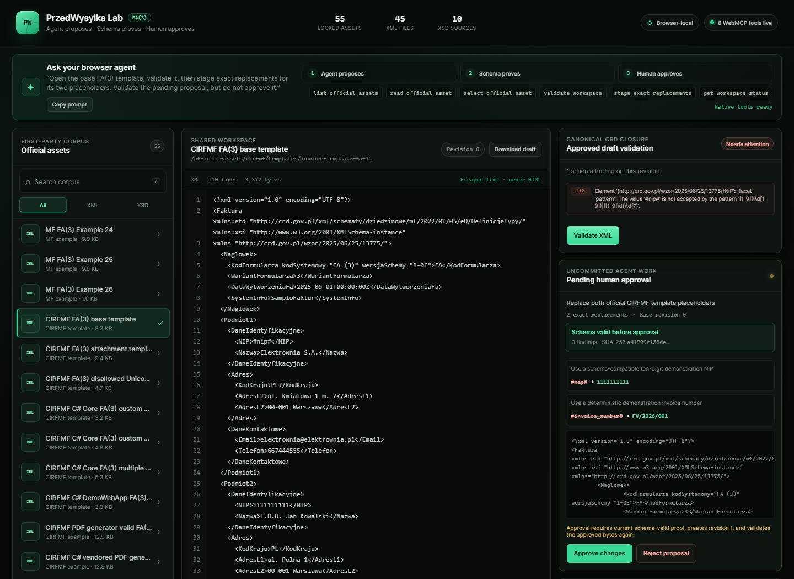

# PrzedWysylka WebMCP Lab

**Agent proposes. Schema proves. Human approves.**

PrzedWysylka WebMCP Lab is a browser-local FA(3) XML workbench where a person and a browser agent share the same official source, validator, pending diff, and audit trail. Through WebMCP, the agent can prepare exact work; approval, rejection, and download are absent from the WebMCP capability surface and remain visible UI actions.



This is a production-build native Chrome capture, not a mock or injected API. [`docs/assets/native-webmcp-smoke.json`](docs/assets/native-webmcp-smoke.json) uses evidence schema version 2 and records Node `22.22.2`, the exact evidence-time Chrome build, `nativeModelContext: true`, `injectedHarness: false`, exactly six tools, a deterministic production-artifact digest, manifest/source-scope/screenshot hashes, an invalid Revision 0, and a valid Revision 1 with no browser errors. The smoke asserts that the preflight hash, pending-status hash, store-proof hash, and final draft hash are equal. It uses an automated Playwright click through the visible UI review control, so it proves the browser's native registration, callback, proof, and UI-gate paths; it does not claim that a person approved this automated test or that an AI model chose the right tools unaided. Like any web interface, browser automation may still actuate UI controls under the browser's own safety policies; this application does not infer a physical human from a click.

> **Publication gate:** the repository does not invent a live deployment or YouTube URL. Those remain explicit operator actions and must be filled in before submission.

## 30-second judge path

1. Open the app in the current ChatGPT Desktop built-in browser with GPT-5.6 Sol or GPT-5.6 Terra. GPT-5.6 Luna currently has WebMCP disabled.[5]
2. Open `Site tools` and expect exactly six tools. Chrome 149+ is the alternative: enable `chrome://flags/#enable-webmcp-testing`, then relaunch.[1][6]
3. Send the exact prompt below.
4. Watch Revision 0 fail canonical validation while the pending proposal earns a schema-valid SHA-256 proof.
5. Click `Approve changes` yourself. Revision 1 is created and validated again.

## Exact agent prompt

> Open the base FA(3) template, validate it, then stage exact replacements for its two placeholders. Validate the pending proposal, but do not approve it.

## What WebMCP changes

| Without WebMCP                                                                            | With WebMCP                                                                                   |
| ----------------------------------------------------------------------------------------- | --------------------------------------------------------------------------------------------- |
| The agent scrapes labels, scrolls source, and guesses which schema or revision is active. | Six narrow tools expose the live corpus, selection, validator, proposal, hashes, and history. |
| A visual edit can silently target the wrong text or stale state.                          | Exact replacements are unique, non-overlapping, atomic, and tied to the current revision.     |
| "Please do not approve" is only a prompt instruction.                                     | No approval tool exists. Approval is an enabled UI action only after current proposal proof.  |
| Large source dumps consume model context.                                                 | Lists, excerpts, findings, and history use explicit limits and continuation metadata.         |

## Who this is for

This lab targets developers, accountants, QA teams, and compliance operators who need help with structured regulatory XML but cannot hand final authority to an agent. FA(3) is a sharp example: one wrong value can invalidate a document, the schema closure is authoritative, and the person responsible still needs to see the exact proposed bytes.

The page already owns the source, schema bundle, validator, and revision state. WebMCP exposes those capabilities directly instead of forcing brittle visual automation or duplicating the workflow behind a remote MCP server.[1]

## WebMCP tool surface

| Tool                       | Effect                                                    | Explicit output boundary                                             |
| -------------------------- | --------------------------------------------------------- | -------------------------------------------------------------------- |
| `list_official_assets`     | Lists filtered locked corpus records                      | Up to 6 per page; returns total, offset, `hasMore`, and `nextOffset` |
| `read_official_asset`      | Reads an official source excerpt                          | Up to 30 lines; original delimiters; line/UTF-16-column cursor       |
| `select_official_asset`    | Synchronizes the shared UI selection                      | One locked asset; never accepts arbitrary paths or bytes             |
| `validate_workspace`       | Validates the approved draft or exact pending proposal    | Full count plus up to 5 compact findings with explicit truncation    |
| `stage_exact_replacements` | Creates an atomic pending proposal                        | 1–20 exact replacements; never applies them                          |
| `get_workspace_status`     | Reads revision, hashes, validation, proposal, and history | Dynamically fits up to 8 newest events and reports omitted history   |

Every successful WebMCP text payload is hard-limited to 1,500 serialized characters. Validation compacts untrusted diagnostic text at Unicode code-point boundaries and reports `messageTruncated`; status reports `historyHasMore`, aggregate summary truncation, and per-summary truncation. Source pages preserve the original CRLF, LF, and CR delimiters so consecutive cursor reads reconstruct the exact decoded source. Tool inputs are checked with Zod in the callback. Descriptions are static developer-authored strings. Official XML is returned as untrusted source data, and read-only tools declare `readOnlyHint`.[3]

## Complete official corpus

The repository does not cherry-pick convenient examples.

| Source class                              | Count | Runtime role                                                |
| ----------------------------------------- | ----: | ----------------------------------------------------------- |
| Ministry of Finance FA(3) example XMLs    |    26 | Expected-valid canonical examples                           |
| CIRFMF FA(3) expected-invalid XML records |    16 | Templates and edge-case fixtures                            |
| CIRFMF FA(3) expected-valid XML records   |     2 | Byte-identical PDF-generator source records                 |
| CIRFMF PEF/UBL XML fixture                |     1 | Adjacent source fixture, explicitly not classified as FA(3) |
| Canonical CRD XSD closure                 |     4 | Active validation root plus all transitive dependencies     |
| CIRFMF C# client XSD source records       |     2 | Provenance/comparison only                                  |
| CIRFMF API FA(3) XSD source records       |     4 | Pinned API-repository provenance                            |

That is **55 locked source records: 45 XML and 10 XSD**, including **44 FA(3) XML source records** and one explicitly adjacent UBL record. The CIRFMF portion contains **18 CIRFMF FA(3) XML source records** from pinned C#, Java, and PDF-generator repositories; they represent 14 unique raw Git blobs. Exact byte duplicates remain separate provenance records and declare `contentDuplicateOf`.

The frozen scope is mechanical: every XML whose default namespace is the canonical FA(3) `13775` namespace in the pinned CIRFMF C#, Java, and PDF-generator snapshots; every XSD directly under the FA schema set in the pinned CIRFMF API snapshot; all 26 XMLs in the official Ministry archive; and the complete canonical CRD closure. FA(2), FA_RR, UPO, authentication, and PEF/UBL are different contracts and are excluded from the FA(3) completeness claim. [`data/official-source-scope.json`](data/official-source-scope.json) records the observation date, definition, exclusions, all six CIRFMF repository pins—including zero-match repositories—and source-record versus unique-blob totals. Every included record has its source URL/path, upstream revision, byte length, SHA-256, namespace, role, and expected validation class in [`data/official-assets.lock.json`](data/official-assets.lock.json).

An independent default-tree census downloads immutable archives for all six repositories, verifies that each pin is still its live `main` head, and partitions all **39 XML and 31 XSD paths** by verifier-owned source rules that do not come from the asset manifest or scope ledger. Repository names, branches, commits, archive URLs, byte counts, hashes, and expected source counts are verifier-owned snapshot identities; the scope ledger must equal them exactly and cannot redirect the census. Live heads come from public-IP-pinned GitHub REST with proxies disabled and connected peers revalidated. The census discovers exactly **18 FA(3) XML and 6 FA(3) XSD paths**, proves the two zero-match repositories from complete tree inventories, and reconciles those discovered identities with the locked corpus. Before Python opens an archive, a bounded parser rejects ZIP64 and checks every central and local header, member count, compressed range, total expansion, XML/XSD member size, duplicate name, and unsafe path. The test suite re-executes the live census instead of trusting the committed report, then independently asserts its complete partitions, roots, manifest equality, retained UBL, and zero-match inventories; [`docs/assets/cirfmf-tree-census.json`](docs/assets/cirfmf-tree-census.json) is the full included/excluded evidence snapshot.

The bundled XML/XSD files are excluded from this repository's MIT license. See the [notice stored beside the assets](public/official-assets/NOTICE.md) and [`THIRD_PARTY_NOTICES.md`](THIRD_PARTY_NOTICES.md).

`npm run verify:assets` hashes all 55 files and verifies every exact-duplicate relationship. Git treats official assets as binary (`-text -diff`) so Windows line-ending conversion cannot corrupt upstream bytes. Every browser fetch also verifies the exact byte count and SHA-256 before decoding or displaying the source.

## Privacy and safety

- No backend, account, cookies, analytics, database, KSeF API, or document upload.
- Validation runs in the current browser tab through `xmllint-wasm`.
- No XML, draft, finding, or history record is sent to an application server.
- Original assets are immutable; proposals target the current approved revision.
- The workspace store defaults to denying replacement proposals unless the typed registry marks the selected source as eligible FA(3) XML.
- Runtime asset paths reject traversal, encoded path segments, backslashes, queries, and fragments before fetch.
- Latest-wins selection and validation operation tokens reject out-of-order or stale asynchronous completions. WebMCP forwards the browser's `AbortSignal` into asset fetches, checks it after asynchronous loading, and a cancelled selection cannot commit after cancellation even if a dependency resolves later.
- Stale, ambiguous, duplicate, missing, or overlapping replacements fail atomically.
- XML is rendered as escaped text, never injected as HTML.
- The production WebMCP API is feature-detected. Unsupported browsers receive an honest status; no polyfill pretends native support.
- Approval, rejection, and download are absent from the WebMCP tool surface and remain visible UI actions.

## Clean-room public boundary

This repository was created during the challenge window. It does **not** contain code copied from the private PrzedWysylka product, production repair rules, KSeF integrations, credentials, configuration, telemetry, or customer data. The implementation is a small clean-room wrapper over public dependencies and public first-party fixtures.

## Run locally

Requirements:

- Node.js `22.22.2`
- npm 10+

```bash
npm ci
npm run dev
```

Open the URL printed by Vite.

### Native WebMCP support

For ChatGPT, update the desktop app, open the site in its built-in browser, and use GPT-5.6 Sol or GPT-5.6 Terra. GPT-5.6 Luna currently has WebMCP disabled. Open `Site tools` in the address bar, choose `Available site tools`, and expect exactly six tools.[5]

For local Chrome testing, use Chrome 149 or later, open `chrome://flags/#enable-webmcp-testing`, set it to **Enabled**, and relaunch.[1][6]

In ordinary browsers, the complete human UI and browser-local validator still work. The header honestly reports `WebMCP unavailable`; production installs no polyfill.

## Verification

```bash
npm run verify:assets   # SHA-256, byte count, and duplicate graph for all 55 assets
npm run verify:scope    # independent six-repository default-tree census
npm test                # unit, contract, corpus, and React interaction tests
npm run typecheck
npm run lint
npm run build           # production bundle, browser worker, and WASM
npm run test:e2e        # real Chromium + standards-shaped injected WebMCP harness + Axe
npm run smoke:native    # production build + system Chrome native modelContext + evidence artifacts
```

`npm run test:e2e` and `npm run capture:demo` use a standards-shaped injected WebMCP harness. They deterministically test registration, callbacks, shared state, the manual fallback, and accessibility, but the injected harness does not prove browser-native WebMCP API, permission, or agent compatibility.

`npm run smoke:native` requires the exact `.nvmrc` runtime, builds the production app, hashes the sorted `dist` tree with `directory-sha256-v1`, starts an owned Vite preview, discovers system Chrome (or `WEBMCP_CHROME_PATH`), enables only `WebMCPTesting`, and drives the real `document.modelContext.getTools()` / `executeTool()` path. It invokes all six callbacks, proves there is no approval tool, validates the approved draft and pending proposal, reads the complete store-owned proof through native status, uses Playwright to click the visible UI control, and waits for valid Revision 1. Evidence schema version 2 binds the production artifact, corpus manifest, source-scope ledger, screenshot, exact proof tuple, and final applied hash.

That native smoke proves browser integration and callback behavior, not model planning quality. The final sub-three-minute recording must still show GPT-5.6 Sol or Terra discovering and using the live site's tools without an injected harness.[5][6]

Optional independent native validity-class gate:

```bash
npm run verify:native
```

It independently checks every FA(3) source record against its declared validity class: 28 expected-valid and 16 expected-invalid records. It compares validity classes, not diagnostic text or line-number identity. Set `XMLLINT_BIN` if `xmllint` is not on `PATH`.

Optional networked upstream replay gate (Python 3):

```bash
npm run verify:scope
```

This independently enumerates every XML/XSD path in the six pinned CIRFMF default trees, classifies XML roots and FA(3) schema paths, verifies live default refs, records all exclusions, and fails unless the discovered sets exactly equal the manifest.

The separate byte replay gate is:

```bash
npm run verify:upstreams
```

It re-downloads all 55 corpus records from 30 corpus HTTP resources, then replays four pinned CIRFMF license resources, for 34 total HTTP resources. Every response and ZIP member is streamed against its exact expected byte count with absolute size caps and a total deadline before SHA-256 comparison. The verifier disables environment proxies, rejects every non-global DNS answer, pins each TCP connection to a validated globally routable IP, rechecks the connected peer, and still uses the official hostname for Host, TLS SNI, and certificate validation. The gate writes [`docs/assets/upstream-verification.json`](docs/assets/upstream-verification.json), bound to the manifest and source-scope SHA-256. This is intentionally a freeze/review gate rather than an offline build dependency.

To regenerate the committed product screenshot from a fresh local production build and execute the registered select → validate → stage callbacks through the injected capture harness:

```bash
npm run capture:demo
```

The injected capture remains a deterministic secondary artifact at [`docs/assets/workbench.png`](docs/assets/workbench.png), bound by [`workbench.capture.json`](docs/assets/workbench.capture.json). The native screenshot above is the judge-facing evidence.

## Architecture

```text
hash-locked official assets
          │
          ▼
typed asset registry ───────────────┐
          │                         │
          ▼                         ▼
canonical CRD resolver aliases   WebMCP bridge
          │                         │
          ▼                         │
 xmllint browser worker             │
          │                         │
          └────────► workspace store ◄──────── React UI
                         │
               original / approved draft
                  / pending proposal
                         │
                    UI review gate
```

See [`docs/architecture.md`](docs/architecture.md) for component boundaries and threat controls.

## Challenge materials

- [`docs/submission.md`](docs/submission.md) — English Devpost copy
- [`docs/demo-script.md`](docs/demo-script.md) — sub-three-minute video runbook
- [`docs/assets/native-webmcp-smoke.json`](docs/assets/native-webmcp-smoke.json) — production native Chrome callback evidence
- [`docs/assets/native-workbench.png`](docs/assets/native-workbench.png) — native pre-approval evidence frame
- [`docs/assets/cirfmf-tree-census.json`](docs/assets/cirfmf-tree-census.json) — independent default-tree completeness evidence
- [`docs/assets/upstream-verification.json`](docs/assets/upstream-verification.json) — live first-party byte replay evidence
- [`THIRD_PARTY_NOTICES.md`](THIRD_PARTY_NOTICES.md) — asset and dependency provenance

The public deployment and final submission remain explicit operator actions.

## Sources

[1] https://developer.chrome.com/docs/ai/webmcp
[3] https://developer.chrome.com/docs/ai/webmcp/secure-tools
[5] https://learn.chatgpt.com/docs/webmcp
[6] https://webmcp.devpost.com/rules

## License

Original project code is released under the [MIT License](LICENSE). Third-party official XML/XSD assets retain their own provenance and are not relicensed by this repository; see [THIRD_PARTY_NOTICES.md](THIRD_PARTY_NOTICES.md).
