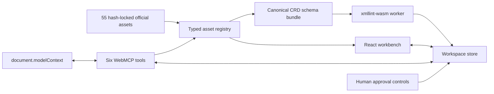

# Architecture

## Goal

Provide one shared, visible browser workspace in which a human and an agent can inspect official FA(3) sources, run the same canonical validation, and review exact changes without granting the agent authority to finalize them.

## Runtime boundaries

### Asset registry

`src/assets/registry.ts` parses the checked manifest through Zod and offers three operations: list, resolve by stable ID, and load text. Runtime paths must be canonical relative paths composed of safe segments under `official-assets/`; dot segments, encoded traversal, backslashes, query strings, and fragments are rejected again immediately before fetch. The build gate independently hashes all 55 source records through `scripts/asset-verifier.mjs` and rejects missing, self-referential, chained, or byte-mismatched `contentDuplicateOf` declarations.

Corpus completeness is frozen to exact upstream commits and source-path inventories. It includes all 26 Ministry examples, every FA(3)-namespace XML path in the pinned CIRFMF C#, Java, and PDF-generator snapshots, the canonical four-file CRD closure, and every FA(3) XSD path in the pinned CIRFMF API snapshot. Adjacent FA(2), FA_RR, UPO, authentication, and PEF/UBL contracts are not represented as FA(3).

`data/official-source-scope.json` closes that universe at the observation date, including zero-match CIRFMF repositories and explicit exclusions. The optional networked `verify:upstreams` gate replays the Ministry ZIP members and every direct CRD/CIRFMF URL, then writes a deterministic report bound to both manifest and scope hashes. Offline builds consume only the vendored, verified bytes.

The runtime never discovers schemas from document-supplied locations. Four canonical CRD IDs are frozen in the manifest.

### Validation adapter

`src/validation/validator.ts` loads the official CRD root and three dependencies, then creates in-memory filename aliases for three exact official `schemaLocation` URLs. This is resolver plumbing, not a modification of the bundled source.

`xmllint-wasm` receives:

- the current XML as a named virtual file;
- the canonical root XSD as the only active schema;
- all three transitive dependencies as preloaded virtual files.

Invalid documents resolve to `valid: false`. Schema/runtime failures reject. The UI never misreports infrastructure failure as user XML invalidity.

### Workspace store

`src/workspace/store.ts` is framework-independent and owns:

- immutable original source;
- current human-approved draft;
- monotonically increasing revision;
- monotonically increasing document generation across selection and approval;
- latest-wins selection and validation operation tokens;
- last validation result;
- at most one pending proposal;
- visible audit events.

A proposal is computed atomically against a base revision. Searches must be non-empty, appear exactly once, and not overlap. The store defaults to denying proposals and requires a registry-backed policy to mark the selected asset as an FA(3) XML document; caller-only XSD/UBL checks are defense in depth. Approval checks both proposal ID and base revision before mutating the approved draft.

### WebMCP bridge

`src/webmcp/register-tools.ts` registers exactly six tools using `document.modelContext.registerTool()`. Read-only and state-changing tools declare `readOnlyHint` explicitly; validation diagnostics are marked untrusted. One `AbortController` owns their lifecycle, and aborting it unregisters every successful partial registration through the WebMCP signal contract if any registration fails.

The bridge deliberately omits approval, rejection, download, arbitrary file upload, network access, and KSeF submission. The agent can stage work; only the human UI can cross the approval boundary.

The API is feature-detected. Tests inject a standards-shaped `ModelContext` harness before page load; production never installs a fallback API.

The official WebMCP explainer defines the Permissions Policy feature as [`tools`](https://github.com/webmachinelearning/webmcp#permissions-policy-and-iframes): top-level windows and same-origin frames are enabled by default, `allow="tools"` delegates access to a frame, and `Permissions-Policy: tools=()` disables it. Production therefore uses `tools=(self)`, preserving this top-level same-origin workbench while refusing cross-origin delegation.

### React workbench

The UI consumes the same store and domain functions as WebMCP callbacks. There is no second state model for the agent.

- Left: complete first-party corpus and provenance-aware selection.
- Center: escaped source text and approved revision.
- Right: validation, pending proposal diff, human controls, audit trail, provenance.

## Threat controls

| Threat                            | Control                                                                         |
| --------------------------------- | ------------------------------------------------------------------------------- |
| Prompt injection inside XML       | Returned source is marked untrusted; XML is data, never tool description text   |
| Agent silently mutates a document | Tools can stage only; no approval tool exists                                   |
| Ambiguous search/replace          | Every search must appear exactly once and all ranges must be non-overlapping    |
| Stale proposal                    | Proposal ID and base revision are checked at approval                           |
| Stale asynchronous selection      | Latest-wins operation token rejects out-of-order load completion                |
| Stale/concurrent validation       | Document generation plus latest operation token reject older results            |
| Schema substitution               | Canonical schema IDs and all source hashes are locked                           |
| Runtime asset substitution        | Every fetched body must match locked SHA-256 and exact byte count before decode |
| Runtime asset path traversal      | Strict path-segment validation runs at manifest parse and immediately pre-fetch |
| Caller bypasses mutation policy   | Store defaults deny and consults the typed-registry eligibility resolver        |
| Line-ending corruption            | Official assets use Git `-text -diff`; fresh-clone hash verification is tested  |
| Browser without WebMCP            | Honest unsupported status; human UI remains functional                          |
| XML-as-HTML injection             | Source is rendered as React text nodes inside `<pre>`                           |
| Data exfiltration by app backend  | There is no backend, upload, account, analytics, or application API             |

## Build artifact

Vite emits a static SPA containing:

- application JS/CSS;
- a dedicated `xmllint-browser` worker chunk;
- the libxml2 WASM binary;
- all locked XML/XSD assets.

Source maps are disabled. Production headers restrict scripts, workers, frames, forms, object embedding, and browser capabilities.
