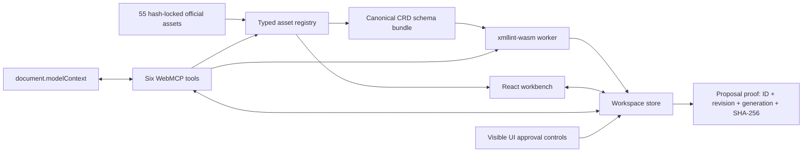

# Architecture

## Goal

Provide one shared, visible browser workspace in which a person and an agent can inspect official FA(3) sources, run the same canonical validation, and review exact changes without exposing finalization through the WebMCP capability surface.

## Runtime boundaries

### Asset registry

`src/assets/registry.ts` parses the checked manifest through Zod and offers three operations: list, resolve by stable ID, and load text. Runtime paths must be canonical relative paths composed of safe segments under `official-assets/`; dot segments, encoded traversal, backslashes, query strings, and fragments are rejected again immediately before fetch. The build gate independently hashes all 55 source records through `scripts/asset-verifier.mjs` and rejects missing, self-referential, chained, or byte-mismatched `contentDuplicateOf` declarations.

Corpus completeness is frozen to exact upstream commits and source-path inventories. It includes all 26 Ministry examples, every FA(3)-namespace XML path in the pinned CIRFMF C#, Java, and PDF-generator snapshots, the canonical four-file CRD closure, and every FA(3) XSD path in the pinned CIRFMF API snapshot. Adjacent FA(2), FA_RR, UPO, authentication, and PEF/UBL contracts are not represented as FA(3).

`data/official-source-scope.json` closes that universe at the observation date, including zero-match CIRFMF repositories and explicit exclusions. The optional networked `verify:upstreams` gate replays the Ministry ZIP members and every direct CRD/CIRFMF URL, then writes a deterministic report bound to both manifest and scope hashes. Offline builds consume only the vendored, verified bytes.

The runtime never discovers schemas from document-supplied locations. Four canonical CRD IDs are frozen in the manifest.

### Validation adapter

`src/validation/validator.ts` loads the official CRD root and three dependencies, then creates in-memory filename aliases for three exact official `schemaLocation` URLs. This is resolver plumbing, not a modification of the bundled source.

`xmllint-wasm` receives:

- the current XML as a named virtual file;
- the canonical root XSD as the only active schema;
- all three transitive dependencies as preloaded virtual files.

Invalid documents resolve to `valid: false`. Schema/runtime failures reject. The UI never misreports infrastructure failure as user XML invalidity.

### Workspace store

`src/workspace/store.ts` is framework-independent and owns:

- immutable original source;
- current approved draft;
- monotonically increasing revision;
- monotonically increasing document generation across selection and approval;
- latest-wins selection and validation operation tokens;
- last approved-draft validation result;
- at most one pending proposal;
- at most one pending-proposal validation proof;
- visible audit events.

A proposal is computed atomically against a base revision. Searches must be non-empty, appear exactly once, and not overlap. The store defaults to denying proposals and requires a registry-backed policy to mark the selected asset as an FA(3) XML document; caller-only XSD/UBL checks are defense in depth.

Validation has two explicit targets: `approved-draft` and `pending-proposal`. A pending-proposal operation snapshots the proposed content together with its asset ID, `proposalId`, `baseRevision`, document generation, and latest-operation token. After canonical validation, the store hashes those exact bytes through its trusted SHA-256 boundary, rechecks the operation token after the asynchronous digest, and records a `ProposalValidationProof` containing the asset ID, `proposalId`, `baseRevision`, document generation, the validated-content snapshot, `proposedSha256`, and the result. A malformed digest or stale operation cannot write proof.

Approval requires the current asset ID, proposal ID, revision, document generation, a valid proof, and byte-for-byte equality between the pending proposal and the validated-content snapshot. The store applies that snapshot rather than rereading mutable proposal state. Beginning another asset selection cancels any in-flight validation and blocks staging or approval; completing selection, staging a different proposal, rejecting, or approving invalidates the proof. Approval then creates the next document generation, clears both validation states, and triggers a separate validation of the newly approved bytes from the React orchestration layer.

### WebMCP bridge

`src/webmcp/register-tools.ts` registers exactly six tools using `document.modelContext.registerTool()`. Read-only and state-changing tools declare `readOnlyHint` explicitly; validation diagnostics are marked untrusted. One `AbortController` owns their registration lifecycle, and aborting it unregisters every successful partial registration if registration fails. Execution callbacks accept the browser-provided cancellation signal when present and create a local signal when the native caller omits the optional options argument. Read and selection callbacks pass that signal into the locked asset loader and check it again after loading; cancellation removes pending selection state and prevents a post-abort selection commit even if a loader ignores the signal and resolves later. Validation callbacks bind abort to the exact pending store context, clear it immediately, and cannot persist a validation result or proposal proof after cancellation even if a dependency resolves later.

`validate_workspace` routes both validation targets through the same canonical adapter. For a pending proposal it returns `proposalId`, SHA-256, validity, full finding count, and a compact finding page while persisting the proof into shared UI state. Every successful tool text payload has a hard 1,500-character postcondition. Finding messages, proposal summaries, and history summaries report text truncation explicitly; the staged-proposal response carries the largest summary prefix that fits with a `summaryTruncated` flag while the store retains the complete summary; status also reports omitted history. Source reads slice the original decoded string without newline reconstruction, preserve CRLF/LF/CR delimiters, reject caller cursors that split a Unicode surrogate pair, and return a line plus UTF-16 code-unit column cursor. Consecutive reads therefore reconstruct exact source text, including minified lines and non-BMP characters.

The bridge deliberately omits approval, rejection, download, arbitrary file upload, network access, and KSeF submission. WebMCP can stage work; applying it requires the visible UI review control. The application does not infer actor identity from a browser-generated click.

The API is feature-detected. Deterministic E2E tests inject a standards-shaped `ModelContext` harness before page load; production never installs a fallback API. A separate production-build smoke launches system Chrome with `WebMCPTesting` and drives native `getTools()` / `executeTool()` without that harness.[1][2]

WebMCP requires an origin-isolated document and uses the `tools` Permissions Policy, which defaults to same-origin access.[1] Production sends `Origin-Agent-Cluster: ?1` and `Permissions-Policy: tools=(self)`, preserving this top-level workbench while refusing cross-origin delegation.

### React workbench

The UI consumes the same store and domain functions as WebMCP callbacks. There is no second state model for the agent.

- Left: complete first-party corpus and provenance-aware selection.
- Center: escaped source text and approved revision.
- Right: explicitly scoped approved-draft validation, proposal SHA-256 preflight, pending diff, visible UI controls, audit trail, and provenance.

## Threat controls

| Threat                            | Control                                                                          |
| --------------------------------- | -------------------------------------------------------------------------------- |
| Prompt injection inside XML       | Returned source is marked untrusted; XML is data, never tool description text    |
| WebMCP silently finalizes a draft | Tools can stage only; no approval tool exists                                    |
| Ambiguous search/replace          | Every search must appear exactly once and all ranges must be non-overlapping     |
| Stale proposal                    | Proposal ID and base revision are checked at approval                            |
| Stale or mismatched proof         | ID, revision, generation, and valid result must match the current proposal       |
| Stale or cancelled selection      | Latest-wins token plus abort checks reject out-of-order or post-abort completion |
| Stale/concurrent validation       | Document generation plus latest operation token reject older results             |
| Schema substitution               | Canonical schema IDs and all source hashes are locked                            |
| Runtime asset substitution        | Every fetched body must match locked SHA-256 and exact byte count before decode  |
| Runtime asset path traversal      | Strict path-segment validation runs at manifest parse and immediately pre-fetch  |
| Caller bypasses mutation policy   | Store defaults deny and consults the typed-registry eligibility resolver         |
| Line-ending corruption            | Git preserves source bytes; cursor excerpts preserve decoded CRLF/LF/CR exactly  |
| Browser without WebMCP            | Honest unsupported status; the visible UI remains functional                     |
| XML-as-HTML injection             | Source is rendered as React text nodes inside `<pre>`                            |
| Data exfiltration by app backend  | There is no backend, upload, account, analytics, or application API              |

## Build artifact

Vite emits a static SPA containing:

- application JS/CSS;
- a dedicated `xmllint-browser` worker chunk;
- the libxml2 WASM binary;
- all locked XML/XSD assets.

Source maps are disabled. Production headers restrict scripts, workers, frames, forms, object embedding, and browser capabilities; the top-level document is origin-isolated for WebMCP.

The native smoke binds pre-commit evidence to the exact production output with the deterministic `directory-sha256-v1` digest. Its schema-version-2 JSON also binds the corpus manifest, source-scope ledger, screenshot, native tool set, proposal proof tuple, and final applied draft hash. The committed evidence test rebuilds `dist` in production mode and recomputes every declared digest.

## Sources

[1] https://developer.chrome.com/docs/ai/webmcp
[2] https://developer.chrome.com/docs/ai/webmcp/imperative-api
